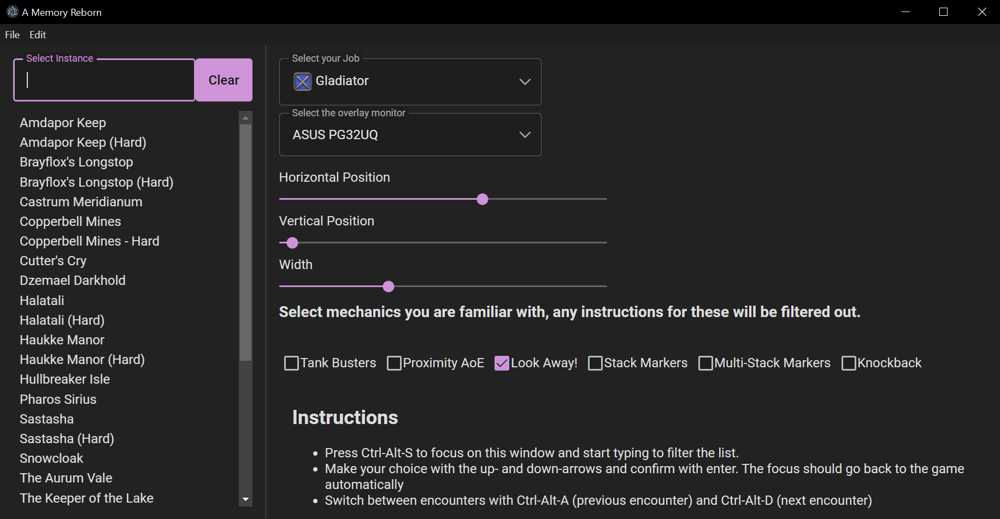

# A Memory Reborn

I play Final Fantasy XIV on and off and often have trouble remembering mechanics when coming back after some time has passed. This, combined with a pinch of performance anxiety makes coming back trickier than it should be. I usually have the wiki open on a second monitor so I can refer to mechanics while running the dungeon/trial/raid. But scrolling through the wiki while not falling behind in a dungeon is not easy. This is the reason I started working on this application. The idea is to have a succinct set of instructions for the current encounter tailored to your situation.

## Features

 - Show a list of instructions for your current encounter on the same screen as the game
 - Switch between encounters with a simple keypress without leaving the game
 - Instructions are tailored to your situation, no instruction on cleansing debuffs when you're not a healer or on interrupting when your job has no interrupts
 - Filter out instructions for mechanics you're already familiar with

## Limitations

 - As I've just started working on this, only ARR dungeons are currently featured inside the program, but I'll work on adding trials, raids for ARR and expansion content as well
 - The application doesn't interact with FFXIV in any way so it can't tell which dungeon/trial/raid you are in, you have to tell it where you are and which boss you're fighting

## Usage

Simply run the application, a window should show up looking like this:

Click a dungeon to see the instructions for it appear on your monitor, optionally select the monitor your game runs on in the "Select the overlay monitor"-dropdown to have the instruction appear on the correct monitor. Select your current job to filter out instructions unrelated to your job, select any mechanics you're already familiar with play around with the sliders to pick an appropriate position for the instructions.

### While playing the game

While in-game, press `Ctrl-Alt-S` to bring AMR to focus and you can immediately start typing to filter the list of dungeons/trials/raids. You can select the dungeon you want by either clicking or using the arrow keys and pressing `enter`. This should bring you have to the game (only pressing `enter` does this, if you clicked you'll have to refocus the game manually). The first encounter's instructions should now be shown, you can switch between encounters with `Ctrl-Alt-A` (previous encounter) and `Ctrl-Alt-D` (next encounter) while in the game, no need to `Alt-Tab`.

## FAQ

### Is this in violation of Square Enix' ban on FFXIV add-ons
I don't _think_ so, this application is completely separate from the game, it doesn't interact with it in any form. It's basically just a more specialized way of having the wiki open on another monitor. However unlikely it is that this falls under said ban, use at your own risk.
